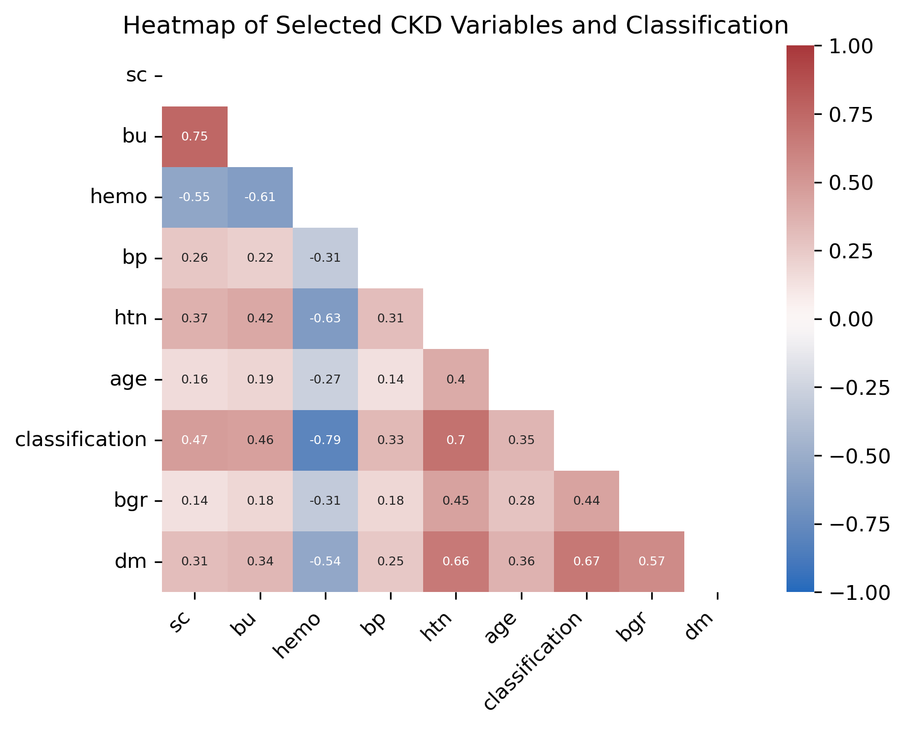
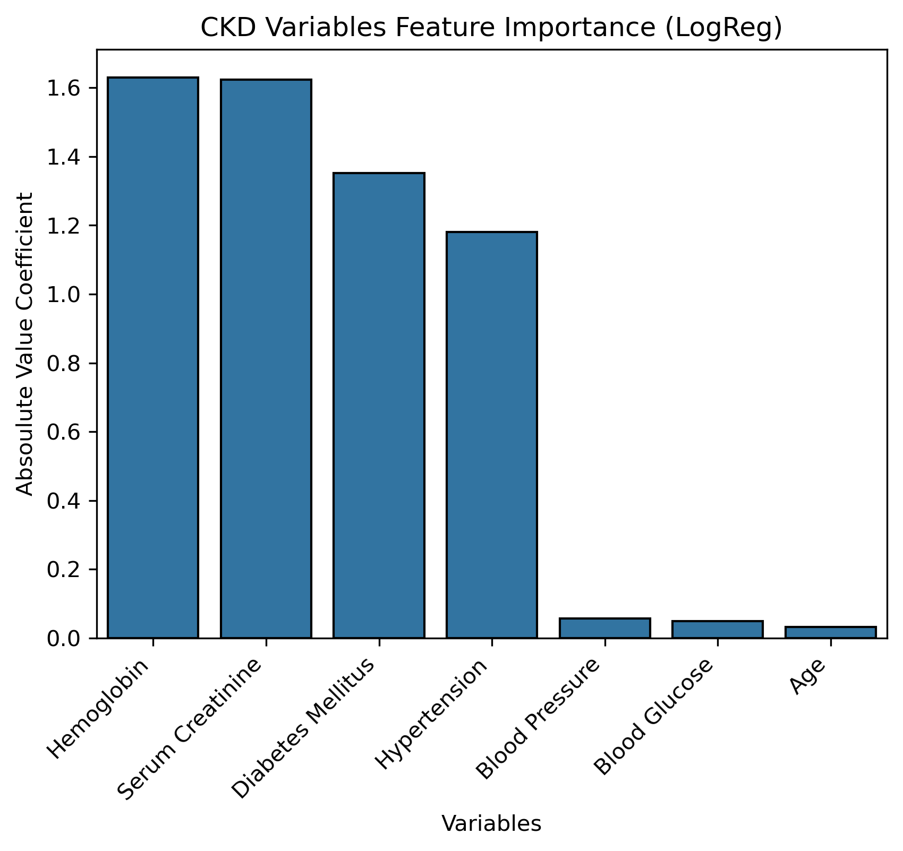

# Chronic Kidney Disease (CKD) Prediction Using Machine Learning

## Dataset
- [UCI ML Repository](https://archive.ics.uci.edu/dataset/336/chronic+kidney+disease)
- Data collected from a hospital in India within 2 months (results may be population specific)
- Records: 400 
- Target Variable: 'classification' (CKD status)
- Features (explored in this project): Hemoglobin (hemo), Serum Creatinine (sc), Blood Urea (bu), Hypertension (htn), Diabetes Mellitus (dm), Blood Glucose Random (bgr), Blood Pressure (bp), Age (age)

## Objectives 

- Run exploratory data analysis (EDA) on clinically relevant CKD indicators, including heatmaps, barplots & chi-squared tests
- Use ML to detect CKD using the selected features of interest (all of which can be obtained with a blood test + basic clinical devices) and flag at-risk patients for clinical testing to confirm the diagnosis 
- Confirm performance across ML models (Logistic Regression, Random Forest, SVMs), due to the smaller dataset
- Perform threshold tuning to minimize false negatives
- Check biomarker sensitivity and explore transformed variables as features

## Data Cleaning 
- Removed rows with missing values from patients who didn't have entries for any of the features of interest, to ensure a complete dataset for analysis
- Had a roughly even split in CKD vs No CKD groups (55-45 ratio)
- Imputation is something to consider for the future since the cleaned data is ~300 patients

## EDA
- Graphed heatmaps of all variables in the data to examine multicollinearity when selecting features of interest
- Using the heatmap and clinically known CKD indicators, chose features of interest and graphed barplots & ran Welch's t-test for continuous variables
- Ran chi-squared test for categorical variables
- Important features like hemoglobin & serum creatinine were double checked with the Mann-Whitney U-test to account for their skewness & unequal variances



## Machine Learning Models

1. ### Logistic Regression
- 5-fold Cross-Validated Accuracy: 0.969
- Top Features: Hemoglobin & Serum Creatinine; Secondary Features: Hypertension & Diabetes Mellitus
- Threshold optimized from 0.5 (default) to 0.175 to prevent false negatives
- Tuned hyperparameters to prevent overfitting (L2 penalty)
- Explored a limited model (for rural areas) w/o chronic condition information (hypertension and diabetes mellitus status)
- Looked into Blood Urea vs Serum Creatinine and ratios of the 2 variables (including a log-transformed version to mitigate extreme values)
- Graphed ROC & Calibration plots 

2. ### Random Forest Classifier
- 10-fold Cross-Validated Accuracy: 0.993
- Top Features: Hemoglobin & Serum Creatinine; Secondary Features: None (comparatively)
- Tuned hyperparameters to prevent overfitting (limiting max depth and min samples)
- Graphed ROC & Calibration plots

3. ### Support Vector Machine (SVM)
- 5-fold Cross-Validated Accuracy: Linear kernel: .976; RBF Kernel (w/o gamma tuning): 0.788
- Top Feature: Serum Creatinine; Secondary Features: Hypertension & Diabetes Mellitus; Tertiary Feature: Hemoglobin
- Graphed scatterplots of combinations of features to visualize if the data is linearly separable
- Tested both linear and RBF kernels & concluded that linear is sufficient for this dataset
- Graphed ROC

## Key Findings
- Serum Creatinine was the best overall indicator of CKD status in terms of feature importance coefficients across all three models
- Hemoglobin was also a top indicator, but due to redundancy in the data, SVM didn't rank it as a top feature, which leaves room for model optimization based on clinical information provided (if deployed)
- The models weighed chronic disease diagnosis (hypertension and diabetes mellitus) much more than the noisier continuous, one-time reading data (blood glucose and pressure), showing the models consistently "trusted" those variables
- When considering generalizability and overfitting, logistic regression remains the best model out of the three with the current dataset
- Random Forest needs further testing to confirm generalizability due to its heavy importance on the top 2 features (hemo & sc)



## Limitations
- The dataset (like a lot of clinical data) is messy and limited in samples, and the models need additional testing with more diverse and larger sets to back up the results
- The accuracy metrics need to be taken with a grain of salt due to the dataset, but the project tells us a lot about the model workflow, learning, and feature importances
- Overfitting is a concern, even after hyperparameter tuning, since it's a relatively small dataset with 2 strong CKD indicators (which easily bias models like Random Forest)
- The data was only collected from 1 hospital in India, so the features are likely biased towards that population 

## Future Work
- A larger, more diverse dataset needs to be tested to confirm the current results and reevaluate the models so that the accuracy metrics are more generalizable
- With bigger data, models like gradient and XGBoosting, which were overkill for the current dataset (due to random forest already being able to max out accuracy nearly), are also an option
- Because of the messy reality of clinical data, imputation methods are also worth exploring, so a larger percentage of the data provided can be used

## Author & Motivation 
My motivation for this project is growing up in India and watching my grandfather go through dialysis every other day due to his CKD. His hypertension accelerated his CKD, and opened my eyes to how prevalent and underdiagnosed it is, especially in rural areas like India, where screening and early detection are limited.  

This project represents my first step toward addressing that gap. Using ML, I aimed to find the features that contribute the most to CKD. Although this project is only the start, it reflects my broader goal to one day develop models that can be deployed to rural areas all across the globe to flag at-risk patients for testing to optimize early detection and treatments. 

**Author**: Ashvath Rajesh 

## Requirements 
All required Python libraries are listed in "requirements.txt" and need to be installed to run the notebooks. To install, run: 

```bash
pip install -r requirements.txt